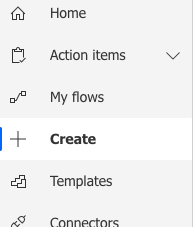
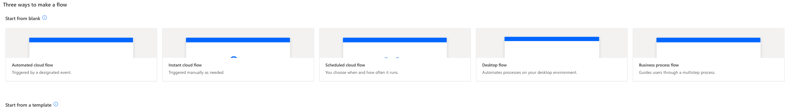
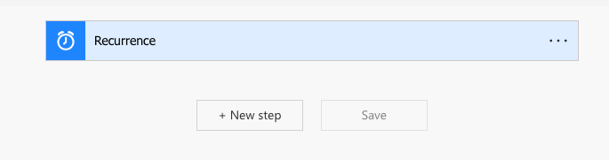
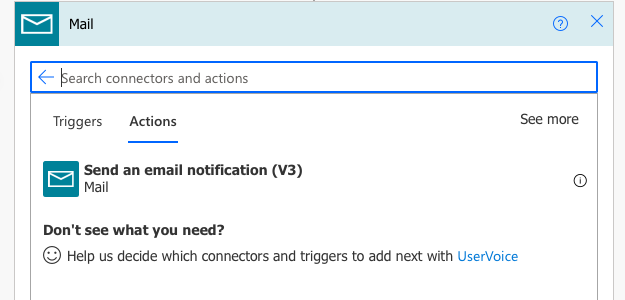
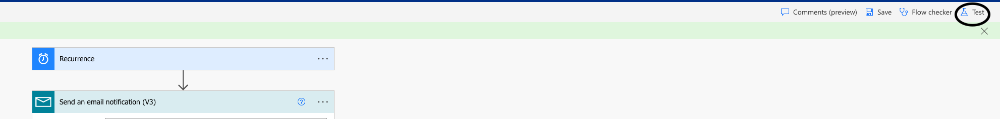

One of the interesting perks of being part of large organization  finding out that you have access to the tools that have power to simplify your life.
One such tool I cam across recently while searching for a solution to a problem I had: MS PowerAutomate.

## Problem

Let me first begin with the problem:
I had to remind a certain group of people to work on a task every friday.
Task was to fill an excel sheet, but it could have been anything: updating JIRA board, updating presentation, finishing PR review.
Broadly, requirement was:
- *Recurring email with fixed body sent to group of people*

<!--break-->

##Solutions

While looking for solutions, few things came to mind:
- Can we use Outlook or email client, to automate it
- Should I send an email or create a Slack channel to remind in it
- Any free, legal tool already present that does this
- Should I write quick and dirty script to do this

On further probing each of above in more details, few points emerged:
- There is no apparaent solution. And I didn't want to spend to go through lot of documentation, undocumented features to see if it is possible. It was too much of time sink for a problem not that high on priority.
- People mute and ignore slack channels. It has to be the email. Creating rules to filter an email still takes a bit more time as well as mail priority could be changed, text could be changed.
- Any such tools are not present on cursory search on google.
- It won't be a quick script. It can't be dirty or else I would be fighting myself 6 months down the line. There might also be permission issues or legal issues in achieving this.

While I was searching for automated way in Outlook, I came across few blogs that mentioned PowerAutomate.
Since it is a Microsoft product, it occured to me that it might be present in MS bundle that is available and I might use it with my business user.

And voila, it is.

## Final Solution

So started the next phase of creating this solution. Once I logged in, it was time to investiage the UI and find out out to build my solution.
Below, I have created step by step guide to create this solution.
It is not super complicated but might help someone who do not want to spend lot of time on it.

Once you log in, go to *Create Flow*

Select a *Scheduled Cloud Flow*

Give it a name and schedule it. And click on Create.

Add a *step* on it.

In Choose operation, select *Email*

Add content in email, recipients

And click on save. Once saved, do a test run for it

Once you are satisfied with the result, save it and validate on your next scheduled run.
